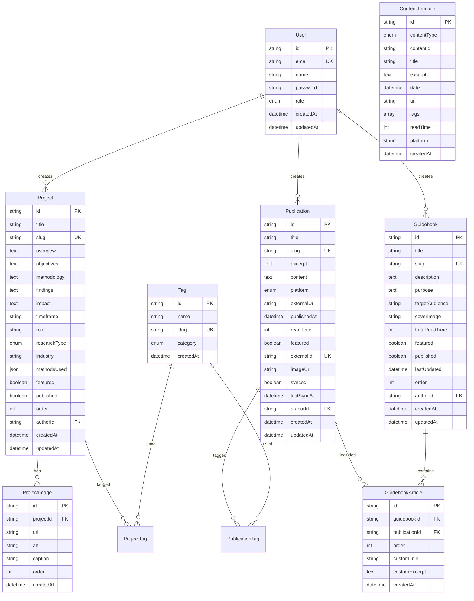

# Database Schema

## Overview

The database uses PostgreSQL 15+ with Prisma ORM for type-safe access. The schema supports user research projects, external publication aggregation, curated guidebooks, and a unified content timeline.

## Entity Relationship Diagram



## Core Tables

### User

Admin authentication and content ownership.

| Field | Type | Constraints | Description |
|-------|------|-------------|-------------|
| id | String | PK, cuid | Unique identifier |
| email | String | UNIQUE, indexed | Login email |
| name | String | required | Admin name |
| password | String | required | bcrypt hashed |
| role | Enum | default: ADMIN | User role |
| createdAt | DateTime | auto | Account creation |
| updatedAt | DateTime | auto | Last update |

**Indexes:** `email`

### Project

User research case studies and portfolio projects.

| Field | Type | Constraints | Description |
|-------|------|-------------|-------------|
| id | String | PK, cuid | Unique identifier |
| title | String | required | Project name |
| slug | String | UNIQUE, indexed | URL-friendly ID |
| overview | Text | required | Brief summary |
| objectives | Text | required | Research goals |
| methodology | Text | required | Approach taken |
| findings | Text | required | Key insights |
| impact | Text | required | Business outcomes |
| timeframe | String | required | Project duration |
| role | String | required | Your role |
| researchType | Enum | required | FOUNDATIONAL, EVALUATIVE, GENERATIVE, MIXED |
| industry | String | optional | Industry domain |
| methodsUsed | JSON | required | Array of methods |
| featured | Boolean | default: false | Homepage feature |
| published | Boolean | default: false | Public visibility |
| order | Int | default: 0 | Display order |
| authorId | String | FK → User | Content owner |

**Indexes:** `slug`, `published`, `featured`, `researchType`, `createdAt`

**Relationships:**
- Many tags via `ProjectTag`
- Many images via `ProjectImage`
- Belongs to `User`

### Publication

Articles from external platforms (Medium, Substack).

| Field | Type | Constraints | Description |
|-------|------|-------------|-------------|
| id | String | PK, cuid | Unique identifier |
| title | String | required | Article title |
| slug | String | UNIQUE, indexed | URL-friendly ID |
| excerpt | Text | required | Article summary |
| content | Text | optional | Full text (cached) |
| platform | Enum | required | MEDIUM, SUBSTACK, EXTERNAL, INTERNAL |
| externalUrl | String | required | Original URL |
| publishedAt | DateTime | required | Publication date |
| readTime | Int | optional | Minutes to read |
| featured | Boolean | default: false | Homepage feature |
| externalId | String | UNIQUE | Platform article ID |
| imageUrl | String | optional | Cover image |
| synced | Boolean | default: false | Auto-synced flag |
| lastSyncAt | DateTime | optional | Last sync time |
| authorId | String | FK → User | Content owner |

**Indexes:** `slug`, `platform`, `publishedAt`, `featured`, `externalId`

**Relationships:**
- Many tags via `PublicationTag`
- Many guidebooks via `GuidebookArticle`
- Belongs to `User`

### Guidebook

Curated collections of publications organized thematically.

| Field | Type | Constraints | Description |
|-------|------|-------------|-------------|
| id | String | PK, cuid | Unique identifier |
| title | String | required | Guidebook name |
| slug | String | UNIQUE, indexed | URL-friendly ID |
| description | Text | required | What it covers |
| purpose | Text | required | Learning objectives |
| targetAudience | String | required | Intended readers |
| coverImage | String | optional | Hero image |
| totalReadTime | Int | default: 0 | Sum of articles |
| featured | Boolean | default: false | Homepage feature |
| published | Boolean | default: false | Public visibility |
| lastUpdated | DateTime | auto | Content changes |
| order | Int | default: 0 | Display order |
| authorId | String | FK → User | Content owner |

**Indexes:** `slug`, `published`, `featured`

**Relationships:**
- Many publications via `GuidebookArticle`
- Belongs to `User`

### Tag

Categorized taxonomy for filtering and discovery.

| Field | Type | Constraints | Description |
|-------|------|-------------|-------------|
| id | String | PK, cuid | Unique identifier |
| name | String | required | Display name |
| slug | String | UNIQUE, indexed | URL-friendly ID |
| category | Enum | required | RESEARCH_METHOD, INDUSTRY, TOPIC, TOOL, SKILL |
| createdAt | DateTime | auto | Creation time |

**Indexes:** `slug`, `category`

**Categories:**
- **RESEARCH_METHOD:** Usability Testing, Interviews, Surveys, etc.
- **INDUSTRY:** E-commerce, Healthcare, Finance, etc.
- **TOPIC:** UX, Accessibility, Analytics, etc.
- **TOOL:** Figma, Miro, UserTesting, etc.
- **SKILL:** Qualitative Analysis, Data Visualization, etc.

## Junction Tables

### ProjectTag

Many-to-many relationship between Projects and Tags.

| Field | Type | Constraints |
|-------|------|-------------|
| projectId | String | PK, FK → Project |
| tagId | String | PK, FK → Tag |

**Composite Primary Key:** `(projectId, tagId)`
**Indexes:** `projectId`, `tagId`

### PublicationTag

Many-to-many relationship between Publications and Tags.

| Field | Type | Constraints |
|-------|------|-------------|
| publicationId | String | PK, FK → Publication |
| tagId | String | PK, FK → Tag |

**Composite Primary Key:** `(publicationId, tagId)`
**Indexes:** `publicationId`, `tagId`

### GuidebookArticle

Ordered publications within a guidebook.

| Field | Type | Constraints | Description |
|-------|------|-------------|-------------|
| id | String | PK, cuid | Unique identifier |
| guidebookId | String | FK → Guidebook | Parent guidebook |
| publicationId | String | FK → Publication | Included article |
| order | Int | required | Sequence number |
| customTitle | String | optional | Override title |
| customExcerpt | Text | optional | Override excerpt |
| createdAt | DateTime | auto | Added date |

**Unique Constraint:** `(guidebookId, publicationId)`
**Indexes:** `guidebookId`, `order`

## Supporting Tables

### ProjectImage

Images and visual artifacts for projects.

| Field | Type | Constraints | Description |
|-------|------|-------------|-------------|
| id | String | PK, cuid | Unique identifier |
| projectId | String | FK → Project | Parent project |
| url | String | required | Image URL (CDN) |
| alt | String | required | Accessibility text |
| caption | String | optional | Description |
| order | Int | default: 0 | Display sequence |
| createdAt | DateTime | auto | Upload time |

**Index:** `projectId`

### ContentTimeline

Denormalized timeline view for fast homepage queries.

| Field | Type | Constraints | Description |
|-------|------|-------------|-------------|
| id | String | PK, cuid | Unique identifier |
| contentType | Enum | required | PUBLICATION, GUIDEBOOK, PROJECT |
| contentId | String | required | Reference ID |
| title | String | required | Content title |
| excerpt | Text | required | Brief description |
| date | DateTime | indexed | Publish/update date |
| url | String | required | Internal link |
| tags | String[] | - | Denormalized tags |
| readTime | Int | optional | Minutes (if applicable) |
| platform | String | optional | Source platform |
| createdAt | DateTime | auto | Timeline entry time |

**Indexes:** `date`, `contentType`, `contentId`

**Purpose:** Optimized for homepage timeline display, avoiding complex joins.

## Enums

```prisma
enum Role {
  ADMIN
  USER
}

enum Platform {
  MEDIUM
  SUBSTACK
  EXTERNAL
  INTERNAL
}

enum ResearchType {
  FOUNDATIONAL
  EVALUATIVE
  GENERATIVE
  MIXED
}

enum TagCategory {
  RESEARCH_METHOD
  INDUSTRY
  TOPIC
  TOOL
  SKILL
}

enum ContentType {
  PUBLICATION
  GUIDEBOOK
  PROJECT
}
```

## Indexing Strategy

### Primary Indexes

All tables have primary key indexes automatically created.

### Secondary Indexes

| Table | Indexed Fields | Reason |
|-------|---------------|--------|
| User | email | Login queries |
| Project | slug, published, featured, researchType, createdAt | Filtering and lookup |
| Publication | slug, platform, publishedAt, featured, externalId | Filtering and sync |
| Guidebook | slug, published, featured | Filtering and lookup |
| Tag | slug, category | Filtering and grouping |
| ContentTimeline | date, contentType | Homepage queries |

### Composite Indexes

```prisma
@@index([published, featured]) // Project
@@index([platform, synced])    // Publication
```

## Query Patterns

### Homepage Timeline

```prisma
// Optimized with ContentTimeline table
const timeline = await prisma.contentTimeline.findMany({
  take: 15,
  orderBy: { date: 'desc' },
  where: { date: { lte: new Date() } }
})
```

### Project with Relations

```prisma
const project = await prisma.project.findUnique({
  where: { slug },
  include: {
    tags: { include: { tag: true } },
    images: { orderBy: { order: 'asc' } },
    author: { select: { name: true } }
  }
})
```

### Guidebook with Articles

```prisma
const guidebook = await prisma.guidebook.findUnique({
  where: { slug },
  include: {
    articles: {
      include: {
        publication: {
          include: { tags: { include: { tag: true } } }
        }
      },
      orderBy: { order: 'asc' }
    }
  }
})
```

### Publications with Filters

```prisma
const publications = await prisma.publication.findMany({
  where: {
    published: true,
    platform: { in: ['MEDIUM', 'SUBSTACK'] },
    tags: { some: { tag: { slug: { in: tagSlugs } } } }
  },
  include: { tags: { include: { tag: true } } },
  orderBy: { publishedAt: 'desc' },
  skip: (page - 1) * limit,
  take: limit
})
```

## Data Integrity

### Cascade Rules

| Parent | Child | On Delete |
|--------|-------|-----------|
| User | Project | CASCADE |
| User | Publication | CASCADE |
| User | Guidebook | CASCADE |
| Project | ProjectTag | CASCADE |
| Project | ProjectImage | CASCADE |
| Publication | PublicationTag | CASCADE |
| Guidebook | GuidebookArticle | CASCADE |
| Tag | ProjectTag | CASCADE |
| Tag | PublicationTag | CASCADE |

### Unique Constraints

- User: `email`
- Project: `slug`
- Publication: `slug`, `externalId`
- Guidebook: `slug`
- Tag: `slug`
- GuidebookArticle: `(guidebookId, publicationId)`

## Migration Strategy

### Initial Setup

```bash
# Create migration
npx prisma migrate dev --name init

# Generate client
npx prisma generate
```

### Schema Changes

```bash
# 1. Modify schema.prisma
# 2. Create migration
npx prisma migrate dev --name description_of_change

# 3. Production deployment
npx prisma migrate deploy
```

### Seeding

```typescript
// prisma/seed.ts
- Create admin user
- Create sample tags (common methods, industries)
- Create 2-3 sample projects
- Create 5-10 sample publications
- Create 1-2 sample guidebooks
- Populate ContentTimeline
```

## Performance Considerations

### Connection Pooling

```prisma
datasource db {
  provider = "postgresql"
  url      = env("DATABASE_URL")
  directUrl = env("DIRECT_DATABASE_URL") // For migrations
}
```

Typical serverless config: 5-10 connections

### Query Optimization

- Use `select` to fetch only needed fields
- Implement pagination (max 100 items)
- Leverage indexes for WHERE clauses
- Use denormalized `ContentTimeline` for complex aggregations

### Denormalization Trade-offs

**ContentTimeline Table:**
- **Pros:** Fast reads, simple queries, no complex joins
- **Cons:** Data duplication, requires update on source changes
- **Decision:** Worth it for homepage performance

## Backup & Recovery

### Automated Backups

- **Frequency:** Daily at 2 AM UTC
- **Retention:** 30 days
- **Provider:** Vercel Postgres automatic backups

### Manual Backup

```bash
# Export database
pg_dump $DATABASE_URL > backup_$(date +%Y%m%d).sql

# Restore database
psql $DATABASE_URL < backup_20250121.sql
```

### Migration Rollback

```bash
# Mark migration as rolled back
prisma migrate resolve --rolled-back "migration_name"

# Apply previous migration
prisma migrate deploy
```

## Future Extensions

### Phase 2 Additions

```prisma
model PageView {
  id          String   @id @default(cuid())
  contentType String
  contentId   String
  userAgent   String
  referer     String?
  createdAt   DateTime @default(now())

  @@index([contentId, createdAt])
}

model ContactSubmission {
  id        String   @id @default(cuid())
  name      String
  email     String
  message   String   @db.Text
  status    String   @default("NEW")
  createdAt DateTime @default(now())

  @@index([status, createdAt])
}

model Subscriber {
  id           String   @id @default(cuid())
  email        String   @unique
  active       Boolean  @default(true)
  subscribedAt DateTime @default(now())
}
```

---

**Last Updated:** 2025-01-21
**Version:** 2.0
**Maintained by:** Development Team
