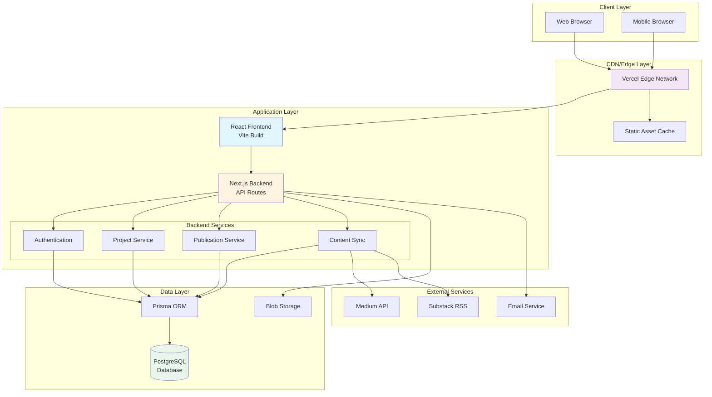
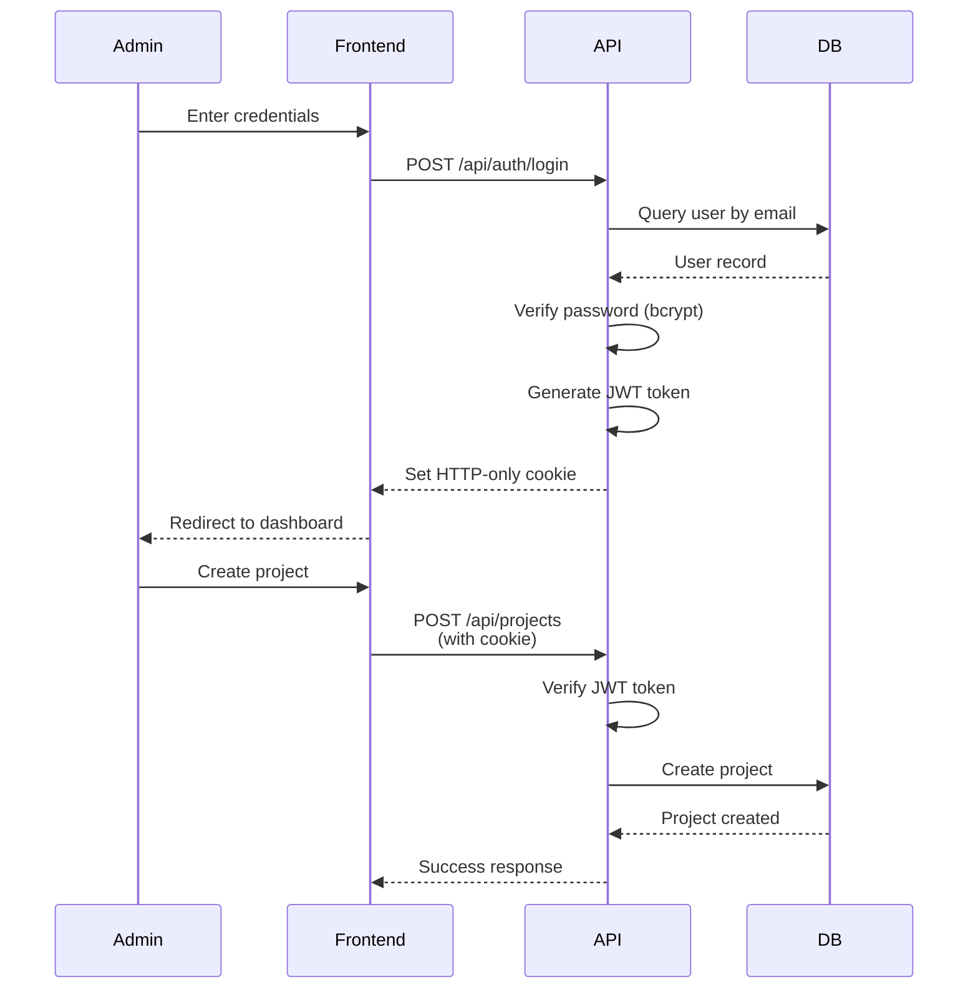
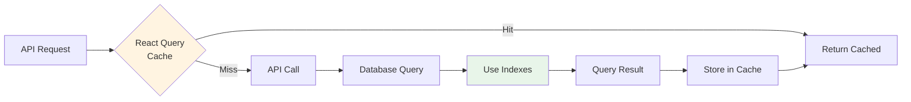
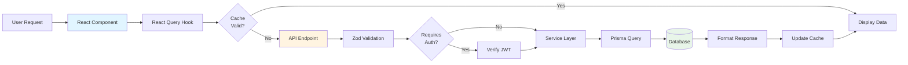
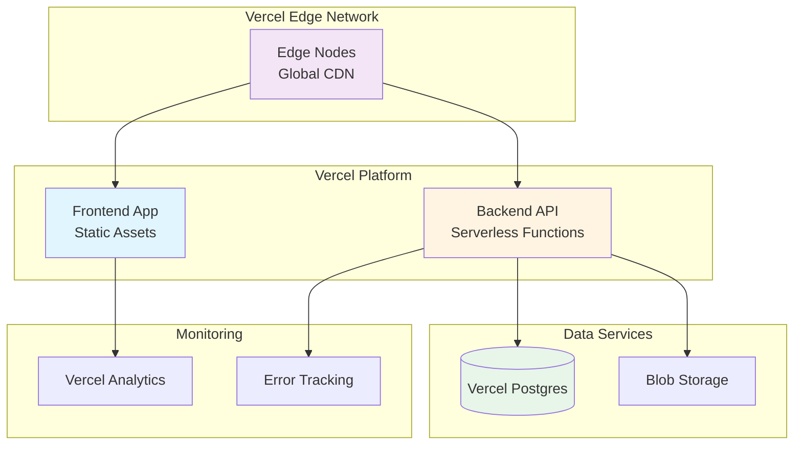
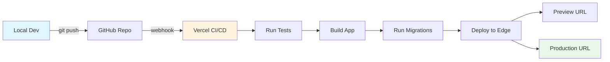

# System Architecture

## Overview

This portfolio website is built on a modern full-stack architecture using Next.js for the backend API, React with Vite for the frontend, PostgreSQL for data persistence, and Prisma ORM for type-safe database access.

## Technology Stack

| Layer | Technology | Purpose |
|-------|-----------|---------|
| **Frontend** | React 18.3 + TypeScript | UI components and interactions |
| | Vite 5.4 | Build tool and dev server |
| | React Router v6 | Client-side routing |
| | Shadcn/UI | Component library |
| | Tailwind CSS | Styling framework |
| | TanStack Query | Server state management |
| **Backend** | Next.js 14+ | API server framework |
| | Node.js 20+ | Runtime environment |
| | Prisma 5+ | ORM and database client |
| | Zod | Schema validation |
| | JWT | Authentication tokens |
| **Database** | PostgreSQL 15+ | Relational data storage |
| **Deployment** | Vercel | Hosting platform |
| | Vercel Postgres | Database hosting |
| | Vercel Blob | File storage |

## System Architecture



## Architecture Layers

### 1. Presentation Layer (Frontend)

**Responsibilities:**
- Render UI components using React
- Handle user interactions and form submissions
- Manage client-side routing with React Router
- Cache server data with TanStack Query
- Provide responsive, accessible user interface

**Key Patterns:**
- Component-based architecture with atomic design
- Custom hooks for shared logic
- React Query for server state management
- Optimistic UI updates for better UX

### 2. API Layer (Backend)

**Responsibilities:**
- Expose RESTful API endpoints
- Validate requests using Zod schemas
- Authenticate and authorize admin requests
- Execute business logic
- Format and return standardized responses

**API Structure:**
```
/api
├── /auth          Authentication endpoints
├── /projects      Project CRUD operations
├── /publications  Publication management
├── /guidebooks    Guidebook collections
├── /timeline      Content timeline feed
├── /tags          Tag management
├── /contact       Contact form handler
└── /admin         Admin dashboard data
```

### 3. Data Access Layer (Prisma ORM)

**Responsibilities:**
- Type-safe database queries
- Automatic TypeScript type generation
- Database migration management
- Connection pooling
- Transaction support

**Key Features:**
- Generated types from schema
- Efficient query optimization
- Relationship management
- Indexed queries for performance

### 4. Database Layer (PostgreSQL)

**Core Tables:**
- `User` - Admin authentication
- `Project` - Research case studies
- `Publication` - Articles from external platforms
- `Guidebook` - Curated article collections
- `Tag` - Categorized taxonomy
- `ContentTimeline` - Denormalized timeline view

## Authentication Flow



## Security Architecture

### Authentication & Authorization

| Aspect | Implementation |
|--------|---------------|
| **Password Storage** | bcrypt hashing (10+ rounds) |
| **Session Management** | JWT tokens in HTTP-only cookies |
| **Token Expiration** | 7 days with refresh mechanism |
| **API Protection** | Middleware validates all admin routes |
| **CSRF Protection** | SameSite cookie flag |

### Input Validation

All API endpoints validate input using Zod schemas:

```typescript
// Example validation
const projectSchema = z.object({
  title: z.string().min(1).max(200),
  overview: z.string().min(10),
  researchType: z.enum(['FOUNDATIONAL', 'EVALUATIVE', 'GENERATIVE', 'MIXED'])
});
```

## Performance Optimization

### Caching Strategy



**Cache Configuration:**

| Endpoint | Stale Time | Cache Time | Strategy |
|----------|-----------|------------|----------|
| Projects | 5 minutes | 30 minutes | stale-while-revalidate |
| Publications | 10 minutes | 1 hour | stale-while-revalidate |
| Timeline | 5 minutes | 30 minutes | stale-while-revalidate |
| Tags | 1 hour | 24 hours | rarely changes |

### Database Optimization

- **Indexes** on frequently queried fields (slug, createdAt, published)
- **Connection pooling** via Prisma for serverless environments
- **Denormalized timeline** table for fast homepage queries
- **Pagination** with skip/take pattern (max 100 items)

## Data Flow Pattern



## Scalability

### Horizontal Scaling

- **Stateless API design** - No server-side session storage
- **JWT tokens** - Self-contained authentication
- **Database connection pooling** - Efficient resource usage
- **CDN for static assets** - Edge distribution

### Vertical Scaling

- **Serverless functions** - Auto-scaling based on demand
- **Database indexes** - Query performance optimization
- **Caching layers** - Reduced database load
- **Lazy loading** - Defer non-critical resources

## Deployment Architecture



## Error Handling

### Error Types

| HTTP Code | Error Type | Usage |
|-----------|-----------|-------|
| 400 | ValidationError | Invalid input data |
| 401 | UnauthorizedError | Missing/invalid credentials |
| 403 | ForbiddenError | Insufficient permissions |
| 404 | NotFoundError | Resource doesn't exist |
| 409 | ConflictError | Duplicate resource (slug) |
| 500 | InternalServerError | Unexpected server error |
| 502 | ExternalServiceError | Third-party service failure |

### Error Response Format

```json
{
  "success": false,
  "error": "Human-readable error message",
  "code": "ERROR_CODE",
  "details": [
    {
      "field": "fieldName",
      "message": "Specific validation error"
    }
  ]
}
```

## Monitoring & Observability

### Key Metrics

- **Response times** - Track P50, P95, P99 latency
- **Error rates** - Monitor 4xx and 5xx responses
- **Database performance** - Query execution times
- **Cache hit rates** - React Query effectiveness
- **User engagement** - Page views, session duration

### Logging

- **Development:** Console logging with detailed output
- **Production:** Structured logging to Sentry
- **Audit trail:** Log all admin actions
- **Performance:** Track slow queries (>500ms)

## Security Measures

| Layer | Security Control |
|-------|-----------------|
| **Network** | HTTPS only, HSTS headers |
| **Application** | Input validation, XSS prevention |
| **Authentication** | JWT with HTTP-only cookies |
| **Authorization** | Role-based access control |
| **Database** | Parameterized queries via Prisma |
| **Rate Limiting** | 100 req/15min (public), 500 req/15min (auth) |
| **CORS** | Whitelist allowed origins |

## Future Enhancements

### Phase 2 Features

- **Full-text search** using PostgreSQL `tsvector`
- **Real-time updates** via WebSocket for admin
- **Advanced analytics** with custom dashboard
- **Image optimization** pipeline with automatic WebP conversion
- **Content versioning** with revision history

### Scalability Improvements

- **Redis caching** for session management
- **Message queue** for async operations (Bull/BullMQ)
- **Read replicas** for database scaling
- **GraphQL layer** (optional) for flexible queries

## Development Workflow



### CI/CD Pipeline

1. **Code Push** - Developer commits to GitHub
2. **Trigger Build** - Webhook activates Vercel build
3. **Install Dependencies** - npm/yarn install
4. **Type Check** - TypeScript compilation
5. **Lint** - ESLint validation
6. **Run Tests** - Unit and integration tests
7. **Build** - Production bundle creation
8. **Migrations** - Database schema updates
9. **Deploy** - Push to edge network
10. **Verify** - Health check endpoints

## Best Practices

### Code Organization

- **Feature-based structure** for maintainability
- **Separation of concerns** across layers
- **Reusable utilities** in shared modules
- **Type safety** with TypeScript throughout

### API Design

- **RESTful conventions** for predictable endpoints
- **Consistent response format** across all routes
- **Versioning strategy** for backward compatibility
- **Comprehensive error messages** for debugging

### Database

- **Migrations** for schema version control
- **Seeding** for test data and initial setup
- **Backup strategy** with daily automated backups
- **Index maintenance** for query performance

---

**Last Updated:** 2025-01-21
**Version:** 2.0
**Maintained by:** Development Team
