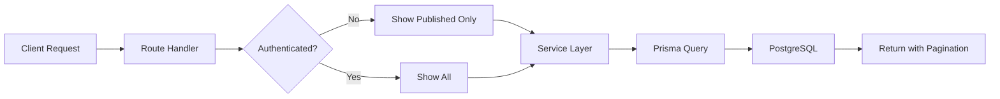

# Projects API Implementation

**Type:** Implementation Guide
**Status:** Implemented
**Last Updated:** 2025-11-21

## Overview

Technical implementation of the Projects CRUD API, including service layer, route handlers, validation, and database operations.

## Architecture

```
API Route ’ Validation ’ Auth Middleware ’ Service Layer ’ Prisma ORM ’ PostgreSQL
```

### Key Components

| Component | Path | Responsibility |
|-----------|------|----------------|
| **Route Handlers** | `/backend/src/app/api/projects/` | HTTP request/response, auth checks |
| **Service Layer** | `/backend/src/services/project.service.ts` | Business logic, transactions |
| **Schemas** | `/backend/src/schemas/project.schema.ts` | Input validation (Zod) |
| **Models** | `/backend/prisma/schema.prisma` | Data model definitions |
| **Middleware** | `/backend/src/middleware/auth.middleware.ts` | Authentication/authorization |

## Data Flow

### GET /api/projects (List Projects)



### POST /api/projects (Create Project)

```mermaid
graph LR
    A[Client Request] --> B[Route Handler]
    B --> C[Validate Auth]
    C --> D[Validate Input]
    D --> E[Service Layer]
    E --> F[Transaction Start]
    F --> G[Create Project]
    G --> H[Create Tags]
    H --> I[Create Images]
    I --> J[Create Timeline Entry]
    J --> K[Transaction Commit]
    K --> L[Return Created Project]
```



## API Endpoints

### GET /api/projects
**File:** `backend/src/app/api/projects/route.ts`

**Query Parameters:**
```typescript
interface ProjectQueryInput {
  page?: number;           // Default: 1
  limit?: number;          // Default: 20, Max: 50
  researchType?: string;   // FOUNDATIONAL | EVALUATIVE | GENERATIVE | MIXED
  industry?: string;       // Filter by industry
  tag?: string;            // Filter by tag slug
  featured?: boolean;      // Filter featured projects
  sort?: string;           // Field to sort by (default: createdAt)
  order?: 'asc' | 'desc';  // Sort order (default: desc)
}
```

**Implementation:**
```typescript
export async function GET(request: NextRequest) {
  try {
    // Optional auth - shows published only if not authenticated
    let userId: string | undefined;
    try {
      const user = await authenticate(request);
      userId = user.userId;
    } catch {}

    const searchParams = Object.fromEntries(request.nextUrl.searchParams);
    const query = projectQuerySchema.parse(searchParams);

    const { projects, pagination } = await projectService.getProjects(query, userId);

    return successResponse(projects, pagination);
  } catch (error) {
    const { message, statusCode, code, details } = handleError(error);
    return errorResponse(message, statusCode, code, details);
  }
}
```

### POST /api/projects
**File:** `backend/src/app/api/projects/route.ts`

**Authentication:** Required (Admin only)

**Request Body:**
```typescript
interface CreateProjectInput {
  title: string;                    // 3-200 chars
  overview: string;                 // 50-5000 chars
  objectives: string;               // 50-5000 chars
  methodology: string;              // 50-10000 chars
  findings: string;                 // 50-10000 chars
  impact: string;                   // 50-5000 chars
  timeframe: string;                // e.g., "3 months"
  role: string;                     // e.g., "Lead Researcher"
  researchType: ResearchType;       // Enum value
  industry?: string;                // Optional
  methodsUsed: string[];            // Array of method names
  featured?: boolean;               // Default: false
  published?: boolean;              // Default: false
  tagIds?: string[];                // Array of tag IDs
  images?: ProjectImage[];          // Array of image objects
}
```

**Implementation:**
```typescript
export async function POST(request: NextRequest) {
  try {
    const user = await authenticate(request);
    requireAdmin(user);

    const body = await request.json();
    const data = createProjectSchema.parse(body);

    const project = await projectService.createProject(data, user.userId);

    return successResponse(project, undefined);
  } catch (error) {
    const { message, statusCode, code, details } = handleError(error);
    return errorResponse(message, statusCode, code, details);
  }
}
```

## Service Layer

**File:** `backend/src/services/project.service.ts`

### getProjects Method

```typescript
async getProjects(query: ProjectQueryInput, userId?: string) {
  const { page = 1, limit = 20, researchType, industry, tag, featured, sort = 'createdAt', order = 'desc' } = query;
  const { skip, take } = calculatePagination({ page, limit });

  // Build where clause
  const where: Prisma.ProjectWhereInput = {
    published: userId ? undefined : true, // Show all if authenticated
    ...(researchType && { researchType }),
    ...(industry && { industry }),
    ...(featured !== undefined && { featured }),
    ...(tag && {
      tags: { some: { tag: { slug: tag } } }
    }),
  };

  // Execute queries in parallel for performance
  const [projects, total] = await Promise.all([
    prisma.project.findMany({
      where,
      include: {
        tags: { include: { tag: true } },
        images: { orderBy: { order: 'asc' } },
        author: { select: { name: true, email: true } },
      },
      orderBy: { [sort]: order },
      skip,
      take,
    }),
    prisma.project.count({ where }),
  ]);

  const pagination = generatePaginationMeta(page, limit, total);

  return { projects, pagination };
}
```

**Key Features:**
- Conditional filtering based on auth status
- Parallel queries for performance (findMany + count)
- Includes related tags, images, and author
- Pagination support
- Flexible sorting

### createProject Method

```typescript
async createProject(data: CreateProjectInput, authorId: string) {
  const { tagIds, images, ...projectData } = data;

  // Generate unique slug from title
  const baseSlug = slugify(data.title);
  const existingProjects = await prisma.project.findMany({
    where: { slug: { startsWith: baseSlug } },
    select: { slug: true },
  });
  const slug = generateUniqueSlug(baseSlug, existingProjects.map(p => p.slug));

  // Use transaction for atomicity
  const project = await prisma.$transaction(async (tx) => {
    // 1. Create project
    const newProject = await tx.project.create({
      data: { ...projectData, slug, authorId, methodsUsed: projectData.methodsUsed },
    });

    // 2. Create tag associations
    if (tagIds && tagIds.length > 0) {
      await tx.projectTag.createMany({
        data: tagIds.map(tagId => ({ projectId: newProject.id, tagId })),
      });
    }

    // 3. Create images
    if (images && images.length > 0) {
      await tx.projectImage.createMany({
        data: images.map(img => ({ projectId: newProject.id, ...img })),
      });
    }

    // 4. Add to timeline if published
    if (newProject.published) {
      const tags = await tx.tag.findMany({
        where: { projects: { some: { projectId: newProject.id } } },
      });

      await tx.contentTimeline.create({
        data: {
          contentType: 'PROJECT',
          contentId: newProject.id,
          title: newProject.title,
          excerpt: newProject.overview,
          date: newProject.createdAt,
          url: `/projects/${newProject.slug}`,
          tags: tags.map(t => t.name),
        },
      });
    }

    return newProject;
  });

  // Return with full relations
  return this.getProjectBySlug(project.slug);
}
```

**Key Features:**
- Automatic slug generation with uniqueness guarantee
- Transaction ensures all-or-nothing semantics
- Creates project, tags, images, and timeline entry atomically
- Returns fully populated project object

## Validation Schemas

**File:** `backend/src/schemas/project.schema.ts`

```typescript
import { z } from 'zod';

export const createProjectSchema = z.object({
  title: z.string().min(3).max(200),
  overview: z.string().min(50).max(5000),
  objectives: z.string().min(50).max(5000),
  methodology: z.string().min(50).max(10000),
  findings: z.string().min(50).max(10000),
  impact: z.string().min(50).max(5000),
  timeframe: z.string().min(1).max(100),
  role: z.string().min(1).max(100),
  researchType: z.enum(['FOUNDATIONAL', 'EVALUATIVE', 'GENERATIVE', 'MIXED']),
  industry: z.string().max(100).optional(),
  methodsUsed: z.array(z.string()).min(1),
  featured: z.boolean().optional().default(false),
  published: z.boolean().optional().default(false),
  tagIds: z.array(z.string()).optional(),
  images: z.array(z.object({
    url: z.string().url(),
    alt: z.string().min(1),
    caption: z.string().optional(),
    order: z.number().int().min(0),
  })).optional(),
});

export const projectQuerySchema = z.object({
  page: z.coerce.number().int().positive().optional(),
  limit: z.coerce.number().int().positive().max(50).optional(),
  researchType: z.string().optional(),
  industry: z.string().optional(),
  tag: z.string().optional(),
  featured: z.coerce.boolean().optional(),
  sort: z.string().optional(),
  order: z.enum(['asc', 'desc']).optional(),
});
```

## Database Schema

**File:** `backend/prisma/schema.prisma`

```prisma
model Project {
  id           String        @id @default(cuid())
  title        String
  slug         String        @unique
  overview     String        @db.Text
  objectives   String        @db.Text
  methodology  String        @db.Text
  findings     String        @db.Text
  impact       String        @db.Text
  timeframe    String
  role         String
  researchType ResearchType
  industry     String?
  methodsUsed  Json
  featured     Boolean       @default(false)
  published    Boolean       @default(false)
  order        Int           @default(0)
  createdAt    DateTime      @default(now())
  updatedAt    DateTime      @updatedAt
  authorId     String

  author  User           @relation(fields: [authorId], references: [id], onDelete: Cascade)
  tags    ProjectTag[]
  images  ProjectImage[]

  @@index([slug])
  @@index([published])
  @@index([featured])
  @@index([researchType])
  @@index([createdAt])
}

model ProjectImage {
  id        String   @id @default(cuid())
  projectId String
  url       String
  alt       String
  caption   String?
  order     Int      @default(0)
  createdAt DateTime @default(now())

  project Project @relation(fields: [projectId], references: [id], onDelete: Cascade)

  @@index([projectId])
}

model ProjectTag {
  projectId String
  tagId     String

  project Project @relation(fields: [projectId], references: [id], onDelete: Cascade)
  tag     Tag     @relation(fields: [tagId], references: [id], onDelete: Cascade)

  @@id([projectId, tagId])
  @@index([projectId])
  @@index([tagId])
}
```

**Indexes:** Optimized for common queries (slug, published, featured, type, date)

## Error Handling

```typescript
// Custom error classes
export class NotFoundError extends Error {
  constructor(resource: string) {
    super(`${resource} not found`);
    this.name = 'NotFoundError';
  }
}

export class ConflictError extends Error {
  constructor(message: string) {
    super(message);
    this.name = 'ConflictError';
  }
}

// Error handler
export function handleError(error: unknown) {
  if (error instanceof NotFoundError) {
    return { message: error.message, statusCode: 404, code: 'NOT_FOUND' };
  }
  if (error instanceof ConflictError) {
    return { message: error.message, statusCode: 409, code: 'CONFLICT' };
  }
  if (error instanceof z.ZodError) {
    return {
      message: 'Validation failed',
      statusCode: 400,
      code: 'VALIDATION_ERROR',
      details: error.errors,
    };
  }
  // Default server error
  return { message: 'Internal server error', statusCode: 500, code: 'INTERNAL_ERROR' };
}
```

## Performance Optimizations

1. **Parallel Queries:** Use `Promise.all` for independent queries
2. **Database Indexes:** Added on frequently queried fields
3. **Selective Includes:** Only include needed relations
4. **Pagination:** Limit result sets with skip/take
5. **Connection Pooling:** Prisma handles connection reuse

## Testing

```typescript
// Example test (using Jest)
describe('ProjectService', () => {
  it('should create project with tags and images', async () => {
    const projectData = {
      title: 'Test Project',
      overview: 'Test overview...',
      // ... other fields
      tagIds: ['tag1', 'tag2'],
      images: [{ url: 'https://...', alt: 'Test', order: 0 }],
    };

    const project = await projectService.createProject(projectData, 'userId');

    expect(project.title).toBe('Test Project');
    expect(project.tags).toHaveLength(2);
    expect(project.images).toHaveLength(1);
  });
});
```

## Related Documentation

- [Projects CRUD Spec](../specs/projects-crud.spec.md) - Requirements
- [Projects Feature](../../02-what/features/projects.md) - Feature description
- [Prisma ORM ADR](../architecture/ADR-002-prisma-orm.md) - Database layer decision
- [Next.js Backend ADR](../architecture/ADR-001-nextjs-backend.md) - API framework choice

---

**Last Updated:** 2025-11-21
