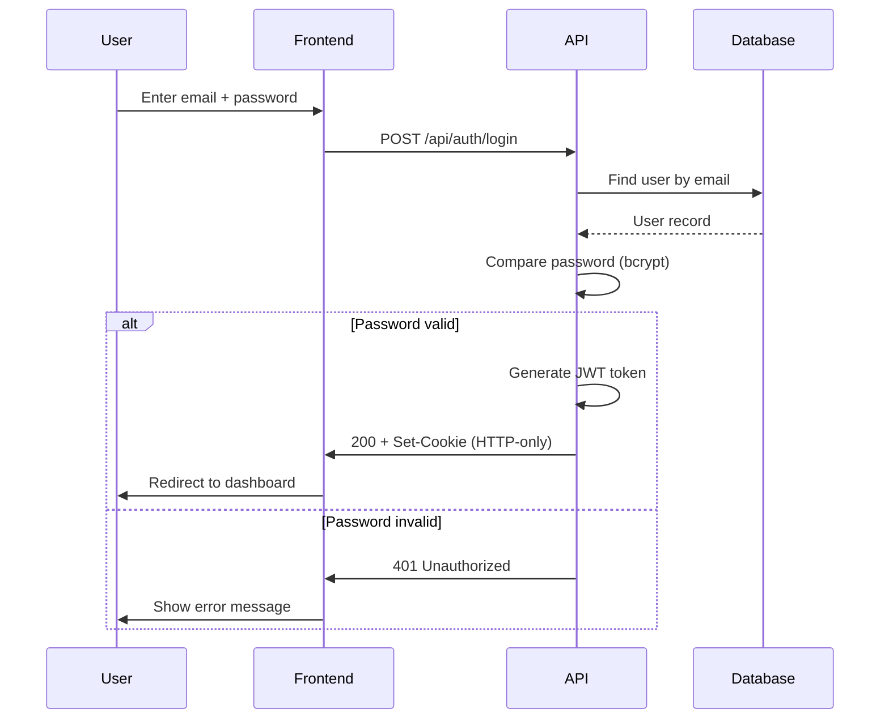
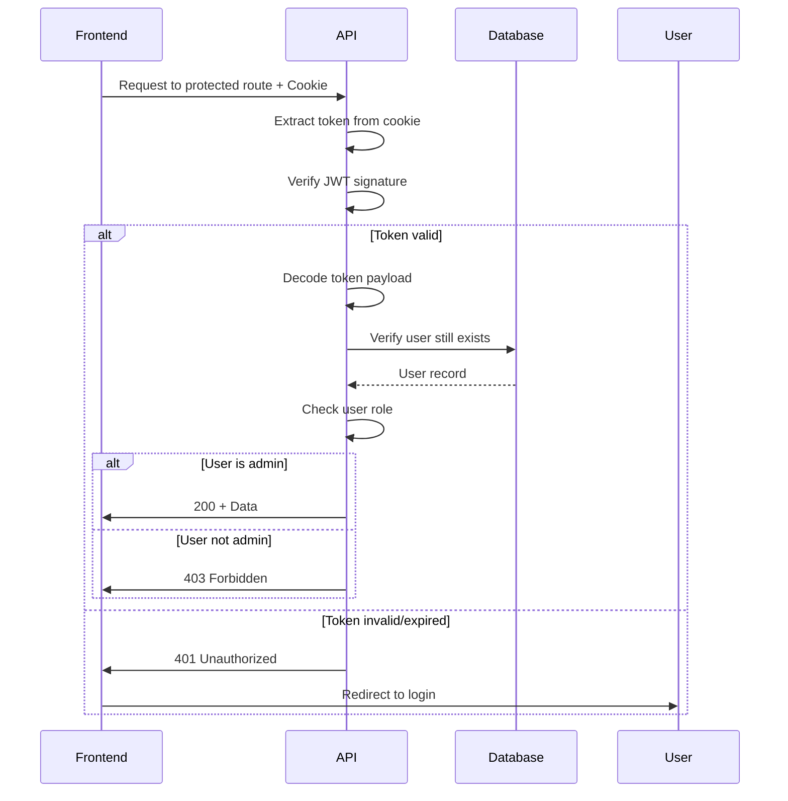
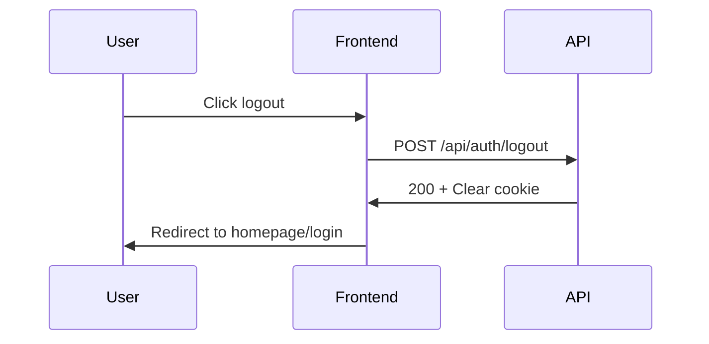

# Authentication System Specification

## Purpose

Define the complete requirements for user authentication, session management, and authorization, including login flow, token management, protected routes, and security measures.

## Scope

### In Scope
- Email/password authentication
- JWT token generation and validation
- HTTP-only cookie storage
- Session persistence (7 days)
- Login and logout flows
- Protected API routes
- Protected frontend routes
- Role-based authorization (admin only)

### Out of Scope
- User registration (manual admin creation only)
- Password reset via email
- Multi-factor authentication (2FA)
- Social login (Google, GitHub, etc.)
- Remember me functionality
- Multiple user roles beyond admin
- Session refresh tokens
- Rate limiting on login attempts

## Data Model

### User Entity

```typescript
interface User {
  id: string;              // CUID
  email: string;           // Unique, required
  name: string;            // Required
  password: string;        // Hashed with bcrypt, never returned in API
  role: Role;              // Enum: ADMIN | USER (only ADMIN in MVP)
  createdAt: DateTime;     // Auto
  updatedAt: DateTime;     // Auto
}

enum Role {
  ADMIN = 'ADMIN',
  USER = 'USER'
}
```

### JWT Token Payload

```typescript
interface TokenPayload {
  userId: string;          // User CUID
  email: string;           // User email
  role: Role;              // User role
  iat: number;             // Issued at (Unix timestamp)
  exp: number;             // Expires at (Unix timestamp)
}
```

## Authentication Flow

### Login Flow



### Session Validation Flow



### Logout Flow



## API Endpoints

### POST /api/auth/login
**Purpose:** Authenticate user and create session

**Request:**
```json
{
  "email": "admin@example.com",
  "password": "securePassword123"
}
```

**Validation:**
- email: Valid email format, required
- password: Minimum 8 characters, required

**Success Response (200):**
```json
{
  "success": true,
  "data": {
    "user": {
      "id": "clxyz123",
      "email": "admin@example.com",
      "name": "Admin User",
      "role": "ADMIN"
    },
    "token": "eyJhbGciOiJIUzI1NiIsInR5cCI6IkpXVCJ9..."
  }
}
```

**Side Effects:**
- Sets `auth-token` cookie with JWT
- Cookie flags: HttpOnly, Secure (prod), SameSite=Strict
- Max-Age: 604800 seconds (7 days)

**Error Responses:**
- 400: Validation error (invalid email format, missing fields)
- 401: Invalid credentials (user not found OR wrong password)
- 500: Server error

**Security Notes:**
- Return generic "Invalid credentials" for both user-not-found and wrong-password
- Do not reveal which credential was wrong (timing attack mitigation)
- Hash comparison uses bcrypt (constant-time)

### GET /api/auth/session
**Purpose:** Verify current session and return user info

**Authentication:** Required (JWT in cookie)

**Success Response (200):**
```json
{
  "success": true,
  "data": {
    "user": {
      "id": "clxyz123",
      "email": "admin@example.com",
      "name": "Admin User",
      "role": "ADMIN"
    }
  }
}
```

**Error Responses:**
- 401: No token, invalid token, or expired token
- 404: User no longer exists (deleted after token issued)
- 500: Server error

**Usage:**
- Frontend calls on app initialization
- Determines if user is logged in
- Fetches current user info for display

### POST /api/auth/logout
**Purpose:** Clear authentication session

**Authentication:** Required (JWT in cookie)

**Success Response (200):**
```json
{
  "success": true,
  "data": {
    "message": "Logged out successfully"
  }
}
```

**Side Effects:**
- Clears `auth-token` cookie
- Sets Max-Age to 0 (immediate expiration)

**Error Responses:**
- 401: Not authenticated (already logged out)
- 500: Server error

## Password Security

### Hashing Algorithm
- **Algorithm:** bcrypt
- **Cost Factor:** 10 rounds (minimum)
- **Salt:** Automatically generated per password
- **Library:** `bcrypt` npm package

### Password Storage
```typescript
// Hashing on user creation/password change
const hashedPassword = await bcrypt.hash(plainPassword, 10);

// Never store plain passwords
// Never log passwords
// Never return passwords in API responses
```

### Password Verification
```typescript
// Constant-time comparison
const isValid = await bcrypt.compare(plainPassword, hashedPassword);
```

### Password Requirements (Future)
- Minimum 8 characters (currently not enforced)
- Mix of uppercase, lowercase, numbers (future)
- No common passwords (future)
- Password change every 90 days (future)

## Token Security

### JWT Configuration
```typescript
const token = jwt.sign(
  {
    userId: user.id,
    email: user.email,
    role: user.role
  },
  process.env.JWT_SECRET,  // 32+ character secret
  {
    expiresIn: '7d',        // 7 days
    algorithm: 'HS256'       // HMAC SHA-256
  }
);
```

### JWT Secret Management
- Store in environment variable `JWT_SECRET`
- Minimum 32 characters (256 bits)
- Randomly generated, never committed to git
- Rotate on security incidents

### Token Validation
```typescript
try {
  const decoded = jwt.verify(token, process.env.JWT_SECRET);
  // Token is valid
} catch (error) {
  // Token is invalid or expired
}
```

### Cookie Configuration
```typescript
response.cookies.set('auth-token', token, {
  httpOnly: true,                              // Prevent JavaScript access
  secure: process.env.NODE_ENV === 'production', // HTTPS only in prod
  sameSite: 'strict',                          // CSRF protection
  maxAge: 7 * 24 * 60 * 60,                   // 7 days
  path: '/',                                   // All routes
});
```

## Authorization Middleware

### Backend Middleware

**Purpose:** Protect API routes requiring authentication

**Implementation:**
```typescript
export async function authenticate(request: NextRequest) {
  // Extract token from cookie
  const token = request.cookies.get('auth-token')?.value;

  if (!token) {
    throw new UnauthorizedError('Authentication required');
  }

  // Verify JWT
  const decoded = jwt.verify(token, process.env.JWT_SECRET);

  // Verify user still exists
  const user = await prisma.user.findUnique({
    where: { id: decoded.userId }
  });

  if (!user) {
    throw new UnauthorizedError('User not found');
  }

  return {
    userId: user.id,
    email: user.email,
    role: user.role
  };
}

export function requireAdmin(user: AuthUser) {
  if (user.role !== 'ADMIN') {
    throw new ForbiddenError('Admin access required');
  }
}
```

**Usage in API Routes:**
```typescript
export async function POST(request: NextRequest) {
  const user = await authenticate(request);
  requireAdmin(user);

  // Protected admin logic
}
```

### Frontend Route Protection

**AuthContext:**
```typescript
interface AuthContextType {
  user: User | null;
  loading: boolean;
  login: (email: string, password: string) => Promise<void>;
  logout: () => Promise<void>;
  isAuthenticated: boolean;
}
```

**Protected Route Component:**
```typescript
function ProtectedRoute({ children }) {
  const { isAuthenticated, loading } = useAuth();

  if (loading) return <LoadingSpinner />;
  if (!isAuthenticated) return <Navigate to="/login" />;

  return children;
}
```

**Usage:**
```tsx
<Route path="/admin/*" element={
  <ProtectedRoute>
    <AdminLayout />
  </ProtectedRoute>
} />
```

## Acceptance Criteria

### AC1: User can login with valid credentials
**Given** a user with valid credentials
**When** they submit the login form
**Then** they are authenticated
**And** JWT token is set in HTTP-only cookie
**And** they are redirected to admin dashboard
**And** dashboard loads successfully

### AC2: User cannot login with invalid credentials
**Given** a user with invalid credentials
**When** they submit the login form
**Then** login fails with 401 status
**And** error message "Invalid credentials" is shown
**And** no token is set
**And** they remain on login page

### AC3: Authenticated user can access protected routes
**Given** an authenticated admin user
**When** they navigate to any admin route
**Then** route loads successfully
**And** user info is displayed
**And** no authentication prompts appear

### AC4: Unauthenticated user cannot access protected routes
**Given** an unauthenticated user
**When** they attempt to access admin routes
**Then** they are redirected to login page
**And** intended destination is preserved
**And** after login, they are redirected to intended page

### AC5: User can logout
**Given** an authenticated user
**When** they click logout
**Then** auth cookie is cleared
**And** they are redirected to homepage/login
**And** subsequent admin route access is denied
**And** session endpoint returns 401

### AC6: Session persists across page reloads
**Given** an authenticated user
**When** they reload the page
**Then** they remain authenticated
**And** user info is fetched from session endpoint
**And** no re-login is required

### AC7: Session expires after 7 days
**Given** a user who logged in 7+ days ago
**When** they attempt to access protected routes
**Then** token is expired
**And** they are redirected to login
**And** error message indicates session expired

### AC8: Token validation fails gracefully
**Given** a request with invalid/tampered token
**When** backend validates the token
**Then** validation fails
**And** 401 status is returned
**And** no sensitive error details are exposed

### AC9: Password is never exposed
**Given** any API response
**When** user data is returned
**Then** password field is never included
**And** password is never logged
**And** password is never visible in network traffic

### AC10: CSRF protection works
**Given** an attacker attempting CSRF
**When** they try to make authenticated requests from another domain
**Then** requests fail due to SameSite=Strict
**And** cookie is not sent cross-origin

## Security Requirements

### Vulnerability Mitigation

| Vulnerability | Mitigation |
|---------------|------------|
| XSS (Cross-Site Scripting) | HTTP-only cookies, input sanitization |
| CSRF (Cross-Site Request Forgery) | SameSite=Strict cookies |
| SQL Injection | Prisma ORM parameterized queries |
| Brute Force | Rate limiting (future), strong passwords |
| Session Hijacking | Secure cookies, HTTPS only in production |
| Token Tampering | JWT signature verification |
| Timing Attacks | Constant-time bcrypt comparison |
| Password Exposure | Never log, never return, never store plain |

### Best Practices
- Store JWT secret in environment variables
- Use HTTPS in production (Secure flag)
- Rotate secrets on security incidents
- Log authentication events (future)
- Monitor failed login attempts (future)
- Implement account lockout (future)

## Performance Requirements

- POST /api/auth/login: < 1000ms (bcrypt is intentionally slow)
- GET /api/auth/session: < 200ms
- POST /api/auth/logout: < 100ms
- Frontend auth check on load: < 300ms

## Error Messages

**User-Facing Messages:**
- "Invalid credentials" (login failure)
- "Your session has expired. Please log in again."
- "Authentication required"
- "Access denied. Admin privileges required."

**Developer Messages (logs only):**
- "User not found: [email]"
- "Password mismatch for user: [id]"
- "Token signature invalid"
- "Token expired at: [timestamp]"

## Future Enhancements

### Phase 2
- Password reset via email
- Login rate limiting (5 attempts per 15 min)
- Account lockout after failed attempts
- Password strength requirements

### Phase 3
- Multiple user roles (admin, editor, viewer)
- User management UI
- Login history tracking
- Session management (view/revoke sessions)

### Phase 4
- Two-factor authentication (2FA)
- Social login (Google, GitHub)
- API key authentication
- Refresh tokens for extended sessions

## Related Documentation

- [Authentication Feature](../../02-what/features/authentication.md) - High-level feature description
- [Authentication Implementation](../implementation/authentication.impl.md) - Technical implementation
- [JWT + Cookies ADR](../architecture/ADR-003-jwt-cookies.md) - Why we chose this approach
- [Admin Panel Feature](../../02-what/features/admin-panel.md) - Features requiring authentication

---

**Status:** Implemented
**Last Reviewed:** 2025-11-21
