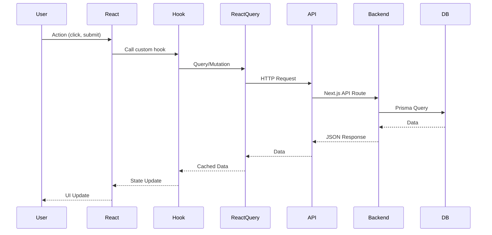

# Getting Started Guide

Quick start guide to run and use your portfolio website with full-stack integration.

## Prerequisites

- Node.js 18+
- PostgreSQL 15+
- npm or yarn

## Quick Start

### 1. Database Setup

```bash
# Create database
psql -U your_username -d postgres -c "CREATE DATABASE portfolio_db;"

# Run migrations and seed
cd backend
npx prisma migrate dev
npm run db:seed
```

### 2. Start Backend

```bash
cd backend
npm install
npm run dev
```

**Backend**: http://localhost:3000

### 3. Start Frontend

```bash
cd frontend
npm install
npm run dev
```

**Frontend**: http://localhost:5173 (or auto-selected port)

### 4. Login to Admin

1. Navigate to: http://localhost:5173/login
2. Default credentials:
   - **Email**: `admin@example.com`
   - **Password**: `changethispassword`
3. Change password after first login!

## Environment Configuration

### Backend `.env`

Required variables:

```bash
DATABASE_URL="postgresql://username@localhost:5432/portfolio_db"
JWT_SECRET="your-secret-key-here"
ALLOWED_ORIGINS="http://localhost:5173,http://localhost:3000"
ADMIN_EMAIL="admin@example.com"
ADMIN_PASSWORD="changethispassword"
```

### Frontend `.env`

```bash
VITE_API_URL=http://localhost:3000
```

## Features Overview

### Admin Panel Routes

| Route | Description |
|-------|-------------|
| `/admin` | Dashboard with statistics |
| `/admin/projects` | Manage research projects |
| `/admin/publications` | Manage articles |
| `/admin/guidebooks` | Manage article collections |
| `/admin/tags` | Manage categorization tags |

### Admin Capabilities

**Projects**
- View all projects (published & drafts)
- Delete projects with confirmation
- Toggle publish/unpublish status
- View tags and metadata

**Publications**
- View all articles
- Delete publications
- See platform badges (Medium, Substack)
- Open external links

**Guidebooks**
- View collections
- Delete guidebooks
- See article counts

**Tags**
- Create new tags
- View by category (Research Method, Industry, Topic, Tool, Skill)
- See usage counts

### Public Site Features

- Homepage with activity timeline
- Featured projects section
- Real-time content updates
- Responsive design

## Data Flow



## Key Technologies

| Layer | Technology |
|-------|-----------|
| Frontend | React 18 + Vite + TypeScript |
| State | React Query + Context API |
| UI | Tailwind CSS + Shadcn/UI |
| Backend | Next.js 14 App Router |
| Database | PostgreSQL + Prisma ORM |
| Auth | JWT (HTTP-only cookies) |
| Validation | Zod schemas |

## Security Features

- ✅ JWT tokens in HTTP-only cookies (XSS prevention)
- ✅ CORS configuration
- ✅ Protected API routes with middleware
- ✅ Input validation with Zod
- ✅ SQL injection prevention via Prisma
- ✅ Rate limiting on sensitive endpoints

## Troubleshooting

### CORS Errors

**Issue**: "Failed to fetch" or CORS errors

**Solution**:
1. Check backend is running on port 3000
2. Verify `VITE_API_URL` in `frontend/.env`
3. Ensure `ALLOWED_ORIGINS` in `backend/.env` includes your frontend URL
4. Restart backend after env changes

### Authentication Issues

**Issue**: Login not working or session lost

**Solution**:
1. Clear browser cookies
2. Verify `JWT_SECRET` is set in `backend/.env`
3. Check browser console for errors
4. Try incognito mode

### Database Connection

**Issue**: "Can't reach database server"

**Solution**:
1. Verify PostgreSQL is running: `psql -l`
2. Check `DATABASE_URL` in `backend/.env`
3. Ensure database exists: `psql -l | grep portfolio_db`
4. Run migrations: `npx prisma migrate dev`

### Data Not Loading

**Issue**: Empty pages or loading states

**Solution**:
1. Check browser console for errors
2. Verify backend API: http://localhost:3000/api/timeline
3. Check database has data: `cd backend && npm run db:studio`
4. Re-seed database: `npm run db:seed`

## Development Workflow

### Adding New Features

1. **Create database models** in `backend/prisma/schema.prisma`
2. **Run migration**: `npx prisma migrate dev --name feature_name`
3. **Create service** in `backend/src/services/`
4. **Add API routes** in `backend/src/app/api/`
5. **Create frontend hook** in `frontend/src/hooks/`
6. **Build UI components** in `frontend/src/components/`
7. **Add pages** in `frontend/src/pages/`

### Testing Changes

```bash
# Backend
cd backend
npm run dev
# Test API: http://localhost:3000/api/endpoint

# Frontend
cd frontend
npm run dev
# Test UI: http://localhost:5173
```

### Database Management

```bash
# Open Prisma Studio (visual database editor)
cd backend
npm run db:studio

# Reset database (caution: deletes all data)
npx prisma migrate reset

# Re-seed database
npm run db:seed
```

## Next Steps

1. ✅ Change admin password
2. ✅ Add your content via admin panel
3. ✅ Customize frontend styling
4. ✅ Configure external integrations (Medium, Substack)
5. ✅ Set up production environment variables
6. ✅ Deploy to Vercel (see [deployment guide](../guides/deployment.md))

## Useful Commands

| Command | Description |
|---------|-------------|
| `npm run dev` | Start development server |
| `npm run build` | Build for production |
| `npx prisma studio` | Open database GUI |
| `npx prisma generate` | Regenerate Prisma client |
| `npx prisma migrate dev` | Run new migrations |
| `npm run db:seed` | Seed database with sample data |

## File Structure Reference

```
portfolio/
├── backend/
│   ├── src/
│   │   ├── app/api/          # API routes
│   │   ├── lib/              # Utilities (auth, db)
│   │   ├── services/         # Business logic
│   │   └── schemas/          # Zod validation
│   └── prisma/
│       ├── schema.prisma     # Database models
│       └── seed.ts           # Seed data
│
└── frontend/
    └── src/
        ├── components/       # React components
        ├── pages/           # Page components
        ├── hooks/           # Custom hooks
        ├── contexts/        # React contexts
        └── lib/             # API client, utils
```

## Production Deployment

See detailed [deployment guide](../guides/deployment.md) for:
- Vercel deployment steps
- Environment variable configuration
- Database hosting (Supabase, Neon)
- CI/CD setup
- Performance optimization

---

**Ready to build!** Explore the admin panel and start adding your research projects and publications.
